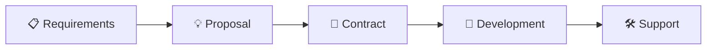

<div align="center">

# 👋 Hi, I'm JinXuchen2020

### 🎯 Full-Stack Developer | Software Outsourcing Expert


---


</div>

---

## 💫 About Me

I am a passionate full-stack engineer with over **5 years of experience**, specializing in modern tech stacks like **Vue.js, React, Node.js, and Flutter**. I provide professional software outsourcing services to clients worldwide.

```yaml
name: JinXuchen2020
location: 🌏 Remote / Worldwide
current_focus: Full-Stack Development & Software Outsourcing
available: Open for new projects
languages: JavaScript, TypeScript, Python, Dart
hobbies: Coding, Learning New Tech, Building Products
```

---

## 🛠️ Tech Stack

<table>
<tr>
<td valign="top" width="50%">

### 🎨 Frontend


</td>
<td valign="top" width="50%">

### ⚙️ Backend


</td>
</tr>
<tr>
<td valign="top" width="50%">

### 📱 Mobile & Cross-Platform


</td>
<td valign="top" width="50%">

### 🗄️ Database & Tools


</td>
</tr>
</table>

---

## 📂 Featured Repositories

<div align="center">

| 🏆 Project | 📝 Description | 🔗 Link |
|:-----------|:---------------|:--------|
| **Portfolio Website** | Personal portfolio & outsourcing services showcase | [](https://github.com/JinXuchen2020/me) |
| **ERP Online** | Enterprise Resource Planning System | [](https://github.com/JinXuchen2020/erp) |
| **Signples E-commerce** | Full-featured e-commerce platform | [](https://github.com/JinXuchen2020/signples) |
| **DAPA Zodiac Wallet** | Digital wallet application | [](https://github.com/JinXuchen2020/wallet) |

</div>

---

## 📊 GitHub Statistics

<div align="center">


</div>

<div align="center">


</div>

<div align="center">


</div>

---

## 🤝 Services I Offer

<div align="center">

| Service | Technologies |
|:--------|:-------------|
| 🖥️ **Web Development** | Vue.js, React, TypeScript |
| 📱 **Mobile Apps** | Flutter Cross-Platform Development |
| ⚙️ **Backend Services** | Node.js, RESTful APIs, GraphQL |
| 🗄️ **Database Design** | MySQL, MongoDB, PostgreSQL |
| 📊 **Management Systems** | ERP, OA, CRM Solutions |

</div>

---

## 💼 Collaboration Process

<div align="center">



| Step | Description |
|:----:|:------------|
| 1️⃣ | **Requirements** - Understand your project needs |
| 2️⃣ | **Proposal** - Technical solution and quote |
| 3️⃣ | **Contract** - Sign and pay deposit |
| 4️⃣ | **Development** - Phased delivery with updates |
| 5️⃣ | **Support** - Testing, deployment, maintenance |

</div>

---

## 🌐 Portfolio Website

<div align="center">

### Check out my professional portfolio for outsourcing services

[](https://jinxuchen2020.github.io/me/)
[](https://jinxuchen2020.github.io/me/en/)

</div>

---

## 📫 Get In Touch

<div align="center">

[](https://github.com/JinXuchen2020)
[](https://github.com/JinXuchen2020/me/issues)

</div>

---

<div align="center">

### 💡 Open for collaboration! Feel free to reach out for any project inquiries.

---


</div>
